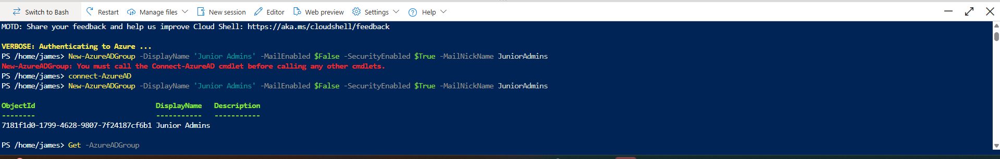
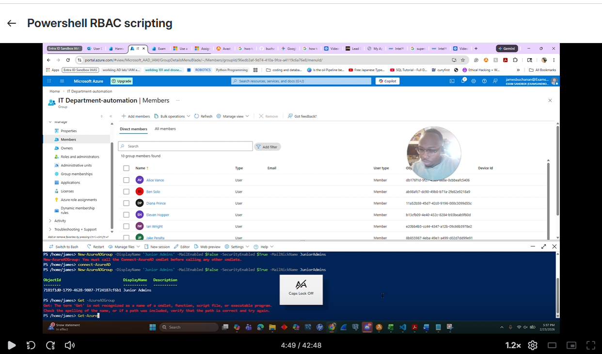
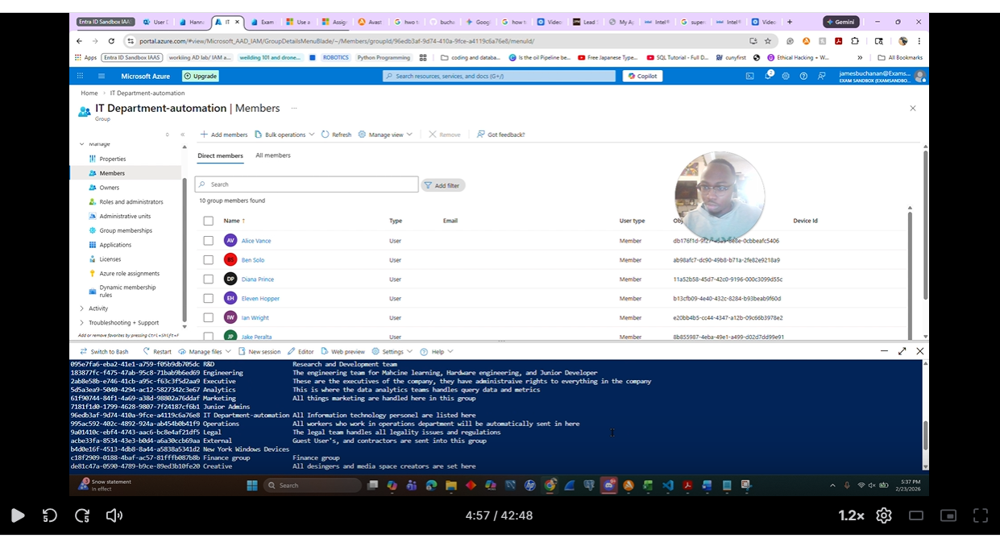
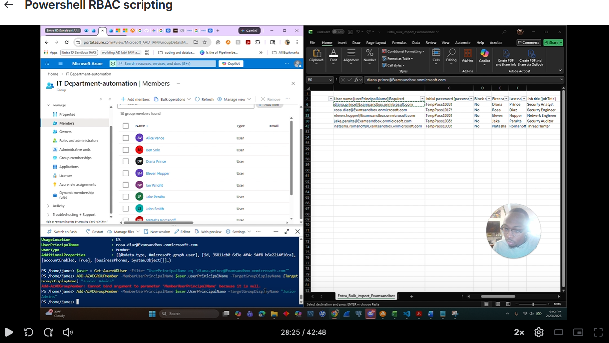
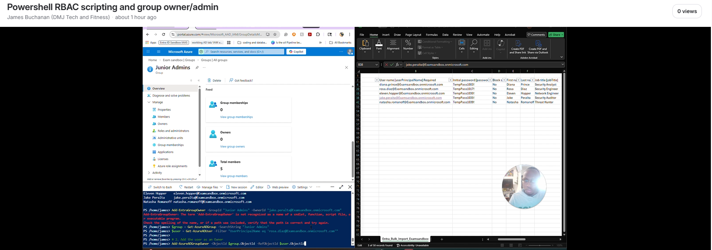

# ENTRA-ID-RBAC-LAb

## Overview
This repository provides an in-depth guide for implementing Role-Based Access Control (RBAC) using Microsoft Entra ID. It covers all necessary phases, tools, and technologies involved in the process.

## Objectives
- Understand the concept of Role-Based Access Control (RBAC).
- Learn how to configure and manage RBAC using Microsoft Entra ID.
- Execute practical examples based on the defined phases.

## Tools & Technologies
- Microsoft Entra ID
- Azure Portal
- PowerShell
- [List any additional tools or technologies here]

## Phases

### Phase 1: Setup the Environment
1. Open the Azure Portal and navigate to Microsoft Entra ID.
2. Create an AD group for your project.
   - 
   - 

### Phase 2: Verification of Azure AD Group
1. Use the Azure CLI or PowerShell to retrieve details of the AD group.
   - 

### Phase 3: Adding Users
1. Add users to your AD group via the Azure Portal or script.
   - 

### Phase 4: Role Management
1. Utilize the group owner and admin scripts to manage permissions effectively.
   - 

### Phase 5: User Interface Management
1. View group admin and member interface.
   - 
   - 

## Conclusion
This guide aims to equip you with the essential knowledge and practical steps to implement RBAC in Microsoft Entra ID effectively. For any queries, feel free to reach out within the repository's discussions section.